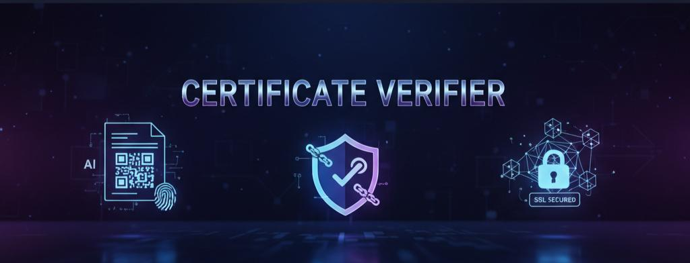

<div align="center">
  

  <h1><b>Certificate Verifier</b></h1>

  <p>
    A cutting-edge tool to verify the authenticity of digital certificates seamlessly. Built with a powerful backend leveraging Machine Learning and Blockchain for unparalleled security and trust. 🛡️
  </p>

  <p>
    <a href="https://github.com/Kansal0920/Certificate-Verifier/stargazers"></a>
    <a href="https://github.com/Kansal0920/Certificate-Verifier/network/members"></a>
    <a href="https://github.com/Kansal0920/Certificate-Verifier/issues"></a>
    <a href="https://github.com/Kansal0920/Certificate-Verifier/blob/main/LICENSE"></a>
  </p>
</div>

---

## 🚀 About The Project

In an age of digital documentation, verifying the authenticity of certificates is paramount. **Certificate Verifier** is a robust web application designed to tackle this challenge head-on. This project allows users to upload a digital certificate, and through a sophisticated backend process leveraging a **Convolutional Neural Network (CNN)** and **Blockchain technology**, it verifies the document's integrity and authenticity against a trusted, decentralized source.

This project showcases a full-stack solution, demonstrating a secure, intelligent, and modern approach to digital verification.

### ✨ Key Features:

* **AI-Powered Verification:** Utilizes a custom-trained CNN model for intelligent feature extraction and validation.
* **Decentralized Trust:** Employs Blockchain to ensure a tamper-proof and transparent verification ledger.
* **Enhanced Security:** Fortified with QR code and SSL encryption for secure data handling and transmission.
* **User-Friendly Interface:** A clean and intuitive UI for a seamless user experience.

---

### 🛠️ Built With

This project is architected with a distinct separation of concerns, utilizing modern technologies for both the client and server sides.

#### **Frontend:**
* 
* 
* 

#### **Backend & Security:**
* 
* 
* 
* **Database System**
* **Blockchain Technology**
* **QR Code Security**
* **SSL Encryption**

---

## 🏁 Getting Started

To get a local copy up and running, follow these simple steps.

### Prerequisites

Before you begin, ensure you have the following installed:
* **Node.js and npm:**
    ```sh
    npm install npm@latest -g
    ```
* **Python & Pip:**
    ```sh
    # Ensure Python and pip are installed and added to your PATH
    ```
* _(Add any other prerequisites here, e.g., database setup)_

### Installation

1.  **Clone the repo:**
    ```sh
    git clone [https://github.com/Kansal0920/Certificate-Verifier.git](https://github.com/Kansal0920/Certificate-Verifier.git)
    ```
2.  **Navigate to the project directory:**
    ```sh
    cd Certificate-Verifier
    ```
3.  **Install Backend dependencies:**
    ```sh
    pip install -r requirements.txt
    ```
4.  **Install Frontend dependencies:**
    ```sh
    npm install
    ```
5.  **Start the application:**
    ```sh
    # Instructions to run both backend and frontend servers
    ```
    _(Adjust these steps based on your actual project setup)_

---

## 💡 Usage

Once the application is running, open your browser and navigate to `http://localhost:3000` (or the appropriate port).

1.  **Upload Certificate:** Click on the "Upload" button and select the certificate file you wish to verify.
2.  **Verify:** The application will process the file using the AI model and check its record on the blockchain, displaying the final verification status.

_(It would be great to add a GIF or screenshot of your project in action here!)_

---

## 🛣️ Roadmap

* [ ] Feature 1: Implement multi-format support (e.g., PDF, JPG, PNG).
* [ ] Feature 2: Develop a more detailed verification history dashboard for users.
* [ ] Feature 3: Enhance the CNN model with a larger dataset for improved accuracy.

See the [open issues](https://github.com/Kansal0920/Certificate-Verifier/issues) for a full list of proposed features (and known issues).

---

## 🤝 Contributing

Contributions are what make the open-source community such an amazing place to learn, inspire, and create. Any contributions you make are **greatly appreciated**.

If you have a suggestion that would make this better, please fork the repo and create a pull request. You can also simply open an issue with the tag "enhancement".

1.  Fork the Project
2.  Create your Feature Branch (`git checkout -b feature/AmazingFeature`)
3.  Commit your Changes (`git commit -m 'Add some AmazingFeature'`)
4.  Push to the Branch (`git push origin feature/AmazingFeature`)
5.  Open a Pull Request

---

## 📄 License

Distributed under the MIT License. See `LICENSE` for more information.

---

## 👨‍💻 Contact

Mr. Bhavya Kansal

[](https://www.linkedin.com/in/kansal0920/)
[](mailto:kansalbhavya27@gmail.com)

Project Link: [https://github.com/Kansal0920/Certificate-Verifier](https://github.com/Kansal0920/Certificate-Verifier)

---

<div align="center">
  Made By Bhavya Kansal
</div>
